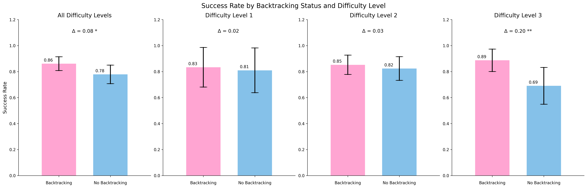
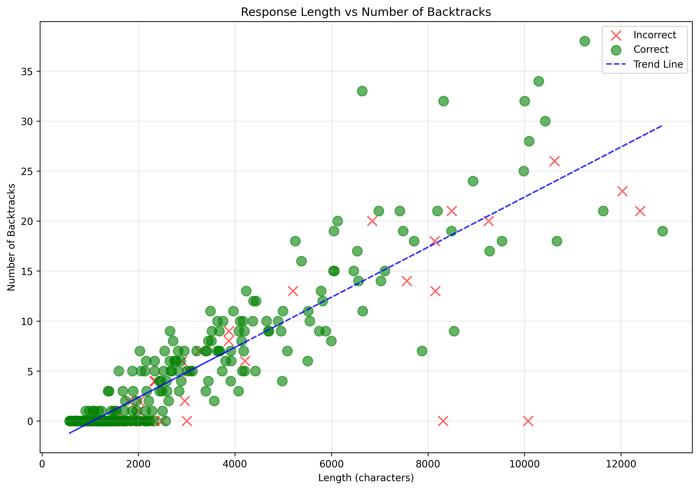
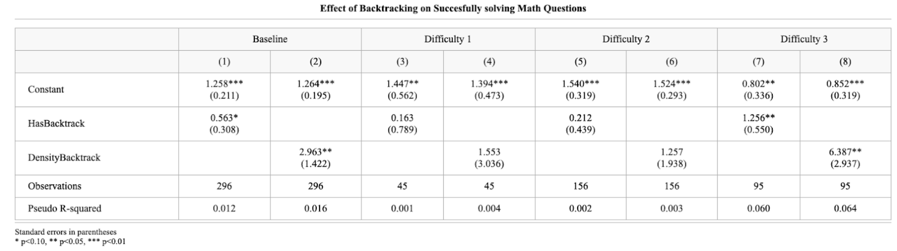

## Abstract
This study investigates whether backtracking, when a model corrects its reasoning path mid-solution, improves performance on mathematical reasoning tasks. Using a subset of 296 problems from GSM8K with the DeepSeek-R1 model, I found backtracking improves success rates by 8.19% overall. This improvement scales with problem difficulty, with the largest gains (+20%) on the hardest problems. Backtracking occurred most frequently in early and middle stages, and the number of backtracks positively correlates with solution length. 

## Data and Variables

I use a subset of the GSM8K dataset with the R1 model, starting with 400 math problems. After filtering for proper answer formatting, I keep 296 valid samples for analysis, which are suitable for analysis. To identify instances of backtracking I use a set of regular expressions, specifically I looked for explicit reconsideration, such as, “wait”, “let me”, “hold on”, among others. To control for the possibility that performance differences might be due to the problem difficulty rather than backtracking, I introduced difficulty levels, and used an operation-based classification to categorize their complexity. Level 1 (Easy): Solutions containing only addition and/or subtraction operations. Level 2 (Medium): Solutions containing either multiplication OR division (but not both). Level 3 (Hard): Solutions containing both multiplication AND division operations. 
 **Figure 1:** Success rate between backtracking and no backtracking across difficulty levels: This figure illustrates the performance differences with and without backtracking across three difficulty levels. Each panel represents a different analysis: overall performance (leftmost) and performance at each difficulty level (1-3). The pink bars represent success rates with backtracking, while blue bars show success rates without backtracking. Error bars indicate 95% confidence intervals. Delta values (Δ) show the difference in success rates between backtracking and no backtracking, with asterisks indicating statistical significance (* p<0.1, ** p<0.05, *** p<0.01).  

Solutions with backtracking demonstrated higher success rates (86.06%) compared to those without (77.86%). Backtracking remained consistent across difficulty levels, though its impact on performance increased with problem complexity. On average, solutions contained 1.07 backtracking instances per 1,000 characters, with a positive correlation between solution length and backtracking frequency. Solutions with backtracking were typically longer than those without across all difficulty levels, with solution length increasing progressively from easier to harder problems. This length difference was controlled for in subsequent analyses through the BacktrackDensity measure to isolate the effect of backtracking beyond simply producing longer responses. If I only capture response length in my initial analysis, I expected the results in BacktrackDensity to be insignificant.

To quantify these effects more precisely, I run a logistic regression as shown in Table 1, that  shows how backtracking functions as a predictor of successful problem-solving across different difficulty levels. The effect of backtracking becomes particularly pronounced for the most complex problems, suggesting that self-correction mechanisms provide the greatest benefit when tackling difficult mathematical operations. 
 
Figure 2: Relationship between response length and number of backtracks. The scatter plot shows a positive correlation, suggesting that longer solutions tend to contain more backtracking instances. 
## Statistical Analysis

**Table 1**: Logistic Regression Results Showing the Relationship Between Backtracking and Problem-Solving Success Across Difficulty Levels.                 

## Limitations
This study has several limitations. First, the detection of backtracking relies on explicit linguistic markers, potentially missing more subtle forms of self-correction. Second, the sample size (296 problems) limits statistical power, especially for subgroup analyses. Third, the operation-based difficulty classification is a simplified proxy for true problem complexity. Finally, the analysis focuses on correlation rather than causation between backtracking and performance..
## Conclusion 
Does backtracking improve performance? Yes, it does, but primarily for complicated questions. The evidence suggests that while backtracking provides limited benefits for simple mathematical problems, it becomes increasingly valuable as problem complexity increases. In future work, I would like to check if adding artificial backtracking would be beneficial for model performance, especially for complex mathematical problems.

